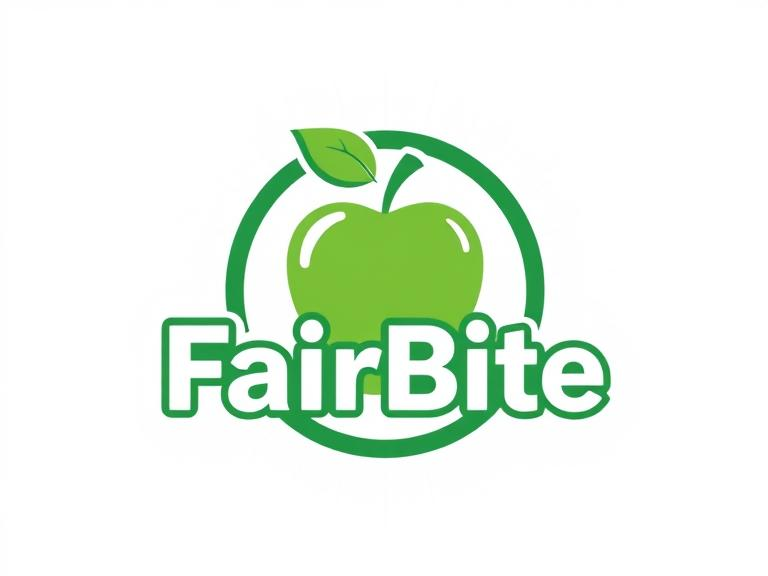
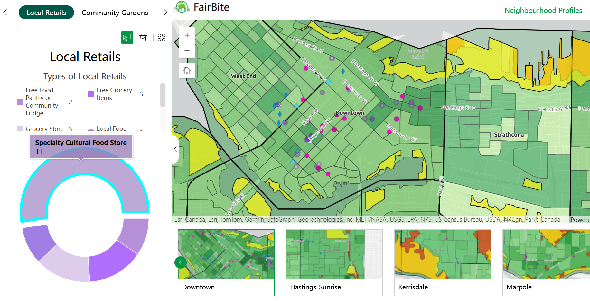
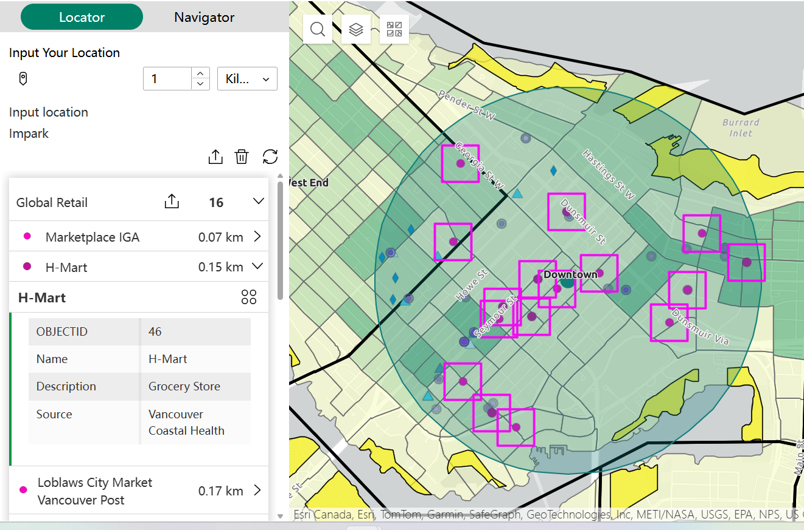
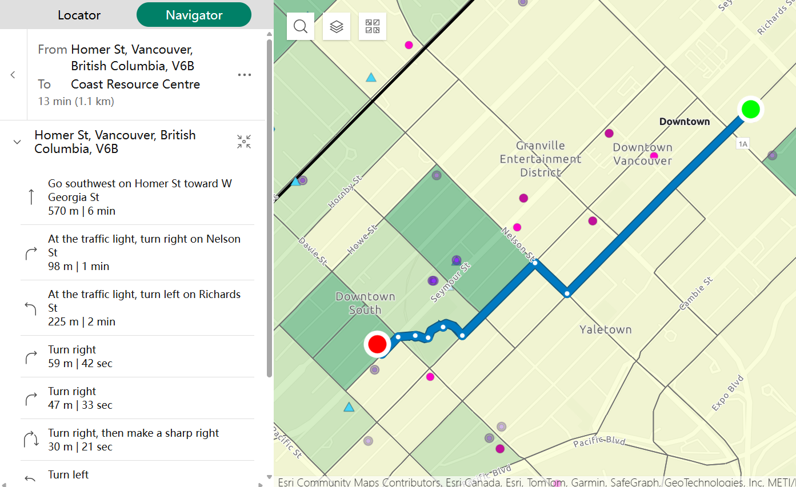
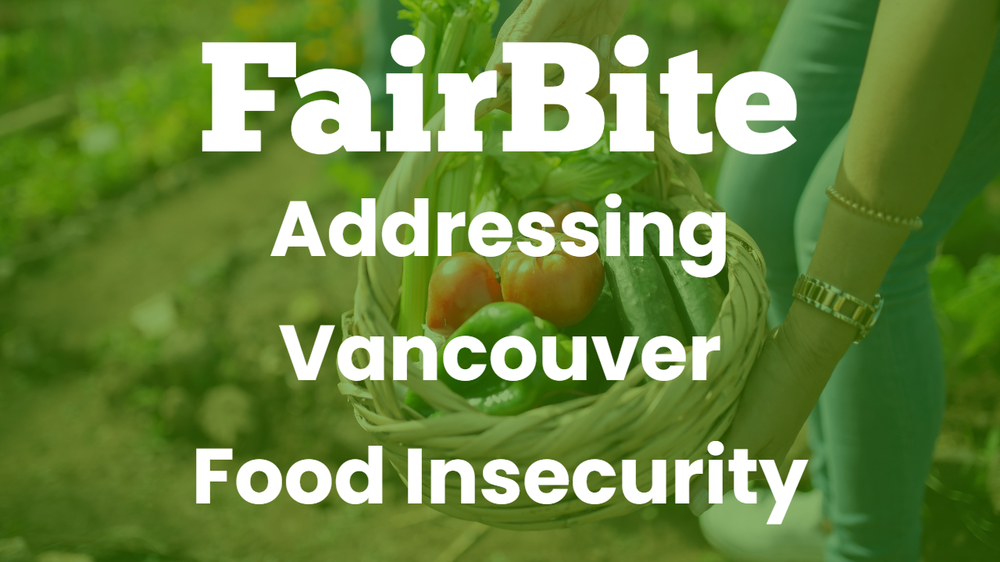

# FairBite
## Addressing Food Insecurity in the City of Vancouver
Experience Builder Web Application designed for the ECCE App Challenge 2025

## Team GigaBite
### Team Members: 
- Sarah Chen
- Si Yeon Kim
- Crystal Wang 

# Mission Statement: 
Economics provides a framework to understand the allocation of finite resources under scarcity, which builds a crucial foundation to understand how the dynamics in the production, distribution, and consumption of goods and services can continue to sustain basic human requirements for future generations.[^1] Access to food is one of these requirements that is becoming increasingly inaccessible as costs of living rise. This has increased levels of food insecurity, which can be defined as the inadequate or insecure access to food due to financial constraints. In 2018, 12.5% of households experienced some extent of food insecurity in British Columbia.[^2] In 2021, this number increased to 14.9% with disruptions in the global food supply and distribution chain after the COVID-19 pandemic.[^3] As of recently in the City of Vancouver, 10.9% of households reported experiencing food insecurity in 2023.[^2] 

So how can we better achieve food security, a future in which all populations have equitable opportunities to physically and socioeconomically access sufficient and nutritious food to meet one’s dietary needs?[^4] FairBite aims to address the multiscalar and multidimensional nuances related to food insecurity in the City of Vancouver. The app is designed to measure the three core facets of food insecurity: food availability, accessibility, and affordability.[^5] Availability refers to the physical supply of nutritious food defined by its production and distribution patterns in the context of associated retailers. Accessibility refers to the ability to obtain food with considerations to travel time, distance, costs, and physical features. Affordability refers to the ability to purchase food within one’s means predicated on household income levels.

# Statement of Characteristics: 
The first page of FairBite is designed for the general public, planners, and stakeholders to assess how experiences of food insecurity can be produced on a macro scale using the Neighbourhood Profile Searcher tool. This tool allows viewers to navigate each of the twenty-two neighbourhoods in the City of Vancouver to visualize the spatial and numeric distribution of average household incomes, food outlet types, and how these trends interact with extent of accessibility to these outlets by walking and transit modes. 

The second page of FairBite is designed to empower the everyday consumer on a micro scale by providing the Locator and Navigator tools. These tools provide navigation to custom filtered food supplier lists that cater to the user’s food purchase and consumption preferences by accounting for relevant economic and proximal factors. 

FairBite provides Vancouver residents with the agency to make informed decisions about how to realistically procure nutritious food based on budget, travel, and supplier considerations on a micro scale, and support research into understanding the trends of food insecurity on a macro scale across neighbourhood boundaries. 

Review the StoryMaps for more details.[^6] [^7] [^8]

# User Guide

## Neighbourhood Profile Searcher

### How to use the first page:
1. Navigate the City of Vancouver’s neighbourhoods using the twenty-two bookmarks located at the bottom of the page. 
2. Visualize the numeric distribution of retail food suppliers, community food outlets, and average household income with the dynamic chart by expanding the left-hand panel
3. Visualize the spatial distribution of food suppliers, household income and % of budget spent on food, and food deserts by walking and transit modes at a dissemination level of analysis by zooming into the map. Toggle on and off relevant layers using the legend button on the top right.
4. Visualize the interactions of household income and food desert distributions by zooming out of the map. Toggle on and off relevant layers using the legend button on the top right.

## Locator and Navigator

### How to use the second page:
1. First use the Locator tool to identify relevant food suppliers near you. Specify the search radius and drop the pin using the button found in the top left hand side of the panel to input your location. Nearby food suppliers categorized by global and local retailers, community meals, and gardens will be returned as a list and highlighted on the map. 

2. Next use the Navigator tool to drop in your current location and the desired food supplier location. Specify the transportation mode and departure time to return an optimized path found on the map with accompanied directions in the panel. 

# StoryMaps

Refer to the [StoryMaps](https://arcg.is/1GHqXv0) for the full background, methodology, and user guide.

# Demonstration Video

_Refer to GitHub Repository for the video link posted on ESRI Canada's YouTube Channel._

# Sources
> [!NOTE]
> This is the full reference list for the App, Video, and StoryMaps. Citation format is not specified but relevant sources are linked as footnotes.

## Data Dictionary

### City of Vancouver Boundaries
| Layer Name | Data Name | Data Type | Data Source |
| --- | --- | --- | --- |
| `Neighbourhoods` | `Vancouver Neighbourhoods Boundaries` | Polygon | [City of Vancouver](https://opendata.vancouver.ca/explore/dataset/local-area-boundary/information/?disjunctive.name) |
| `Dissemination Area` | `Vancouver Dissemination Area` | Polygon | [ArcGIS Living Atlas](https://bcitgis.maps.arcgis.com/home/item.html?id=0d0ae0aa40d44e71a2ac48533a0c2de4) |

### Availability Analysis Data

| Layer Name | Data Name | Data Type | Data Source |
| --- | --- | --- | --- |
| `Global Retails` | `Global Stores` | Point | [OpenStreetMap (OSM)](https://www.google.com/maps/d/viewer?mid=1g_Oq-Jy_aAe7COWikucPdXSCczHo-Hw&hl=en_US&femb=1&ll=49.20200751348373%2C-122.3536809&z=10) + [Vancouver Coastal Health](https://www.google.com/url?q=https://www.vch.ca/en/service/food-asset-maps%23short-description--5756&sa=D&source=docs&ust=1743398406046151&usg=AOvVaw1a9VFhHIc5cT0by7olGnhu) |
| `Local Retails` | `Local Stores` | Point | [OpenStreetMap (OSM)](https://www.google.com/maps/d/viewer?mid=1g_Oq-Jy_aAe7COWikucPdXSCczHo-Hw&hl=en_US&femb=1&ll=49.20200751348373%2C-122.3536809&z=10) + [Vancouver Coastal Health](https://www.google.com/url?q=https://www.vch.ca/en/service/food-asset-maps%23short-description--5756&sa=D&source=docs&ust=1743398406046151&usg=AOvVaw1a9VFhHIc5cT0by7olGnhu) |
| `Community Meals` | `Meals` | Point | [Vancouver Coastal Health](https://www.google.com/url?q=https://www.vch.ca/en/service/food-asset-maps%23short-description--5756&sa=D&source=docs&ust=1743398406046151&usg=AOvVaw1a9VFhHIc5cT0by7olGnhu) + [City of Vancouver](https://opendata.vancouver.ca/explore/dataset/free-and-low-cost-food-programs/information/) |
| `Community Gardens` | `Gardens` | Point | [Vancouver Coastal Health](https://www.google.com/url?q=https://www.vch.ca/en/service/food-asset-maps%23short-description--5756&sa=D&source=docs&ust=1743398406046151&usg=AOvVaw1a9VFhHIc5cT0by7olGnhu) + [City of Vancouver](https://opendata.vancouver.ca/explore/dataset/community-gardens-and-food-trees/export/) |

### Affordability Analysis Data

| Layer Name | Data Name | Data Type | Data Source |
| --- | --- | --- | --- |
| `Household Income By Neighbourhood` | `2024 Median Household Income` | Float | [Business Analyst Data](https://pro.arcgis.com/en/pro-app/latest/tool-reference/analysis/enrich.htm) |
| `Household Income By Dissemination Area` | `2024 Median Household Income` | Float | [Business Analyst Data](https://pro.arcgis.com/en/pro-app/latest/tool-reference/analysis/enrich.htm) |

### Accessibility Analysis Data

| Layer Name | Data Name | Data Type | Data Source |
| --- | --- | --- | --- |
| `Transit Desert` | `GTFS` | Text | [TransLink](https://abacus.library.ubc.ca/dataset.xhtml?persistentId=hdl:11272.1/AB2/QQLSCJ) |
| `Walk and Transit Desert` | `Census block spatial outlines` | Polygon | [Statistics Canada](https://www12.statcan.gc.ca/census-recensement/2011/geo/bound-limit/bound-limit-2016-eng.cfm) |
| `Transit Desert` | `Vancouver Streets ` | Line | [City of Vancouver](https://opendata.vancouver.ca/explore/dataset/public-streets/information/) |
| `Transit Desert` | `Network Dataset Template ` | XML | [Esri](https://pro.arcgis.com/en/pro-app/latest/help/analysis/networks/create-and-use-a-network-dataset-with-public-transit-data.htm) |

## Video Sources
 1. https://www.pexels.com/video/a-couple-doing-their-groceries-4121739/
 2. https://www.pexels.com/videoa-boy-placed-inside-a-push-cart-passing-through-the-vegetable-section-in-a-grocery-3191108/
 3. https://www.pexels.com/video/elderly-couple-taking-shopping-baskets-8420588/
 4. https://www.pexels.com/video/a-man-selling-fruits-and-vegetables-8540478/
 5. https://www.pexels.com/video/a-person-getting-the-cherry-tomatoes-inside-a-paper-bag-9058267/
 6. https://www.pexels.com/video/time-lapse-video-of-a-person-pushing-a-grocery-cart-4309719/
 7. https://www.pexels.com/video/assorted-fruits-and-vegetables-8540479/
 8. https://www.pexels.com/video/group-of-people-eating-together-3245641/
 9. https://www.pexels.com/video/couple-paying-at-the-counter-in-the-grocery-4121754/
 10. https://www.pexels.com/video/video-of-a-moving-train-6163368/
 11. https://www.pexels.com/video/daytime-city-traffic-5535905/
 12. https://www.pexels.com/video/city-clouds-haze-travel-4265473/
 13. https://www.pexels.com/video/judge-using-a-gavel-6699964/
 14. https://globalnews.ca/video/11074046/company-wants-to-clean-vancouver-city-hall-building/
 15. https://youtu.be/sdwcB_KIcmU?si=ClucySnvbh6YWRx-

## StoryMap Sources
[^1]: Polasky et al., 2019: https://www.pnas.org/doi/epdf/10.1073/pnas.1901616116 
[^2]: Hasdell et al., 2023: http://www.bccdc.ca/Documents/2023-10-18_HouseholdFoodInsecurityReport.pdf 
[^3]: Tarasuk et al., 2022: https://utoronto.scholaris.ca/items/d8b8ff54-8a6d-40ac-98b4-4dd2ba1191a1 
[^4]: FAO, 2002: https://www.fao.org/agrifood-economics/publications/detail/en/c/122100/ 
[^5]: Carson and Boege, 2020: The Intersection of Food Availability, Access, & Affordability with Food Security and Health
[^6]: Holmes et al. 2018: https://www.tandfonline.com/doi/full/10.1080/19320248.2018.1465001?scroll=top&needAccess=true 
[^7]: Widener, 2018: https://www.sciencedirect.com/science/article/pii/S003193841830091X?casa_token=h1prol9HgNIAAAAA:WqrzxWnFFIggol7WiKYH1i42M9cvZ5SRrlOb9a4N-8w_19nA7-V1tai-T4hvjeBOvvq92T75nRI 
[^8]: Charreire et al., 2010: https://www.cambridge.org/core/journals/public-health-nutrition/article/measuring-the-food-environment-using-geographical-information-systems-a-methodological-review/084217DE840179EFBC4F1CF812E6266D 