# **ECCE App Challenge 2025**

## **Hungry Heros - University of Waterloo**

## **Team Members**
- Sudiksha Desai
- Kevin Leung
- Weronika Fydrych

## **Mission Statement**

The Harvest app seeks to enhance food security in Kitchener by providing essential information on accessible and affordable means of accessing fresh food including community gardens, foraging and urban trees. Our platform maps existing community gardens, offering residents easy access to fresh produce and shared green spaces. We also showcase Kitchener's urban tree inventory, highlighting fruit-bearing trees that contribute to local food sources. Additionally, we identify underutilized lots that can be transformed into productive, sustainable food sources. The public, urban planners and organizations can utilize this information to improve local food systems and affordability.

## **Growing Your Own Food**

With the rising cost of living, accessing affordable, fresh food is more crucial than ever. To that, we say, look no further than your own neighborhood!

Growing your own food is a powerful way to improve food security, reduce environmental impact, and reconnect with the land. Whether through urban fowl, or community gardens, urban agriculture can help individuals and communities gain better access to fresh, nutritious food.

## **Community Gardens**

A shared part of land that allows members in the neighbourhood to grow fruits, vegetables, and herbs cooperatively.

**Benefits**

- Provides fresh and affordable food to residents.

- Provide food source alternatives and encourages a sustainable lifestyle.

- Builds social connections and fosters community engagement.

## **Urban Trees**

Urban trees are excellent sources of nutritious, fresh food with the local conditions supporting the growth of various fruits including hackberries and crabapples. Many urban trees owned by the City bear fruit and improve the micro-climate of the community.

**Benefits**

- Provide edible fruits (apples, pears, serviceberries).

- Support biodiversity and local food production.

- Regulate temperature and improve the landscape.

## **Urban Fowl**

Urban fowl can be a sustainable food source that provides fresh eggs and reduces carbon footprints by lessening the environmental costs associated with transportation and distribution.

**Benefits**

- Fresh, locally sourced eggs with no additives.

- Improve food security in the neighborhood.

- Natural pest control and composting benefits through manure use.

**Regulations & Best Practices**

- Setbacks

	1. Exterior portions of the chicken coop must meet the setback regulations

	2. Chicken coops are not permitted in a front yard

	3. 2.5m from a side lot line, 1.2m from rear lot line, 2.5m from a rear lot line abutting a side yard

	4. If these setbacks are not achieved, you need to have your neighbour's consent

	5. If the hen house in placed within an existing shed/garage, the setbacks only apply to portion actually used to house hens.

- Structure

	1. Chicken coops much provide protection and adequate ventilation

	2. The enclosed coop and run shall be built to prohibit rodents and predators from entry

	3. Find our more about the interior and exterior regulations using the link below.

- Food and Water

	1. Feeders and water containers must be provided, cleaned regularly, and stored in rodent proof containers

- Deceased chickens

	1. Deceased chickens must be disposed of through a facility as approved by the Ministry of Agriculture Food and Rural Affairs.

## **Data**

1. Community Gardens Dataset

Source: City of Kitchener

Last Updated: Daily – February 18, 2025

The Community Gardens dataset displays the location of community gardens across the City of Kitchener. The data details characteristics of community gardens (location, size, and whether it is public or managed by a specific organization) allowing users, like us, to understand availability and distribution of gardening spaces across the city.

2. Urban Trees Inventory

Source: City of Kitchener

Last Updated: Daily – January 19, 2025

The Tree Inventory dataset displays the location of city street trees across the City of Kitchener. The data details the characteristics of trees (categories, size of the trees, and condition), allowing users like us to understand trees in our community.

## **User Guide**

**1. Community Garden Interactive Map**

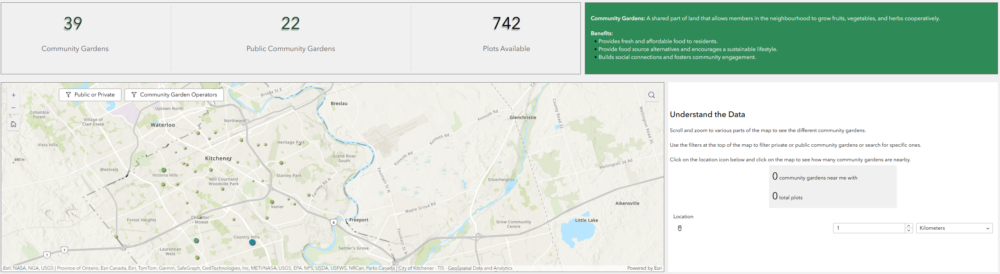

This map helps the user locate the community gardens in their area. The user can, therefore, promptly locate the gardens that are accessible to them.

**Before you start**

- Scroll and zoom to various parts of the map to see the different community gardens.

- Use the filters 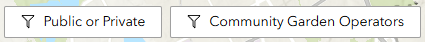

at the top of the map to filter private or public community gardens or search for specific ones.

- Click on the location icon below and click on the map to see how many community gardens are nearby.

**Step-by-step guide**

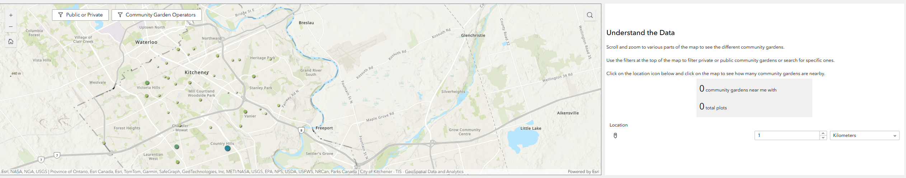

By clicking the 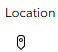

button, you can pinpoint your location in the City of Kitchener.

Then, change the radius tool 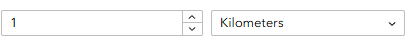
to adjust the area of interest.

The meter  would update based on your options.

**Example**

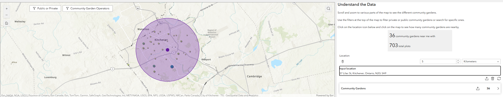

**2. Grow Your Food Throughout the Year Guide**

This guide allow you access basic information to start your planting in Kitchner in different seasons.

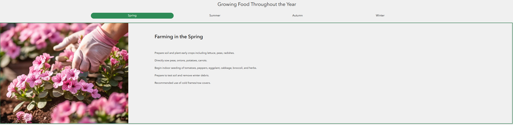

**3. Urban Tree inventory**

This map helps the user locate the urban tree species in their area. The user can, therefore, promptly locate the interested species that are accessible to them.

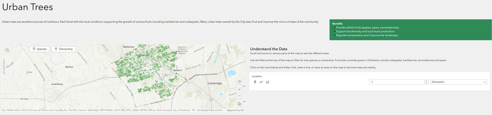

**Before you start**

- Scroll and zoom to various parts of the map to see the different trees.

- Use the filters 

 at the top of the map to filter for tree species or ownership. Fruit trees currently grown in Kitchener include crab-apples, hackberries, serviceberries and pears.

Click on the icons below and either click, draw a line, or draw an area on the map to see how trees are nearby.

**Step-by-step guide**

By clicking the 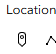 button, you can pinpoint your location in the City of Kitchener.

Then, change the radius tool 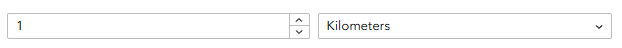 to adjust the area of interest.

The bottom would display the number of trees 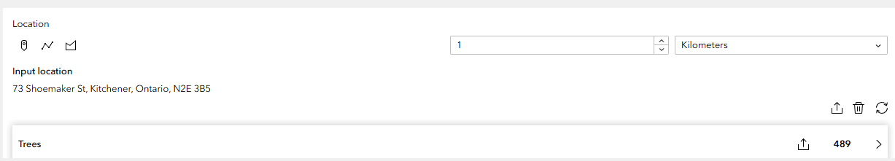 based on your options.

Click the 

button to expand the list of trees in the area.

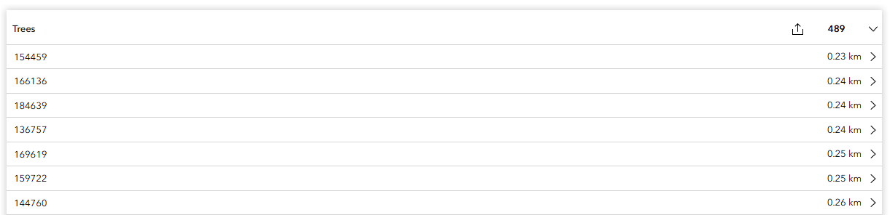

The map would also select the trees in the area.

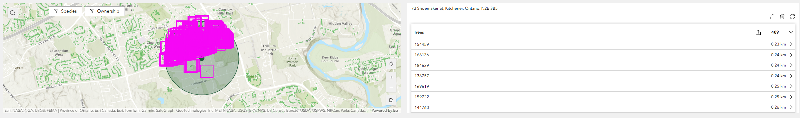

**4. Urban Fowl Guide**

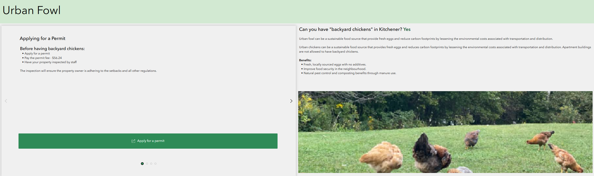

It is an informative guide to the user who is interested to start their urban fowl and need some basic information.

There are 4 section, where user can navigate including:

1. Information about the permit application

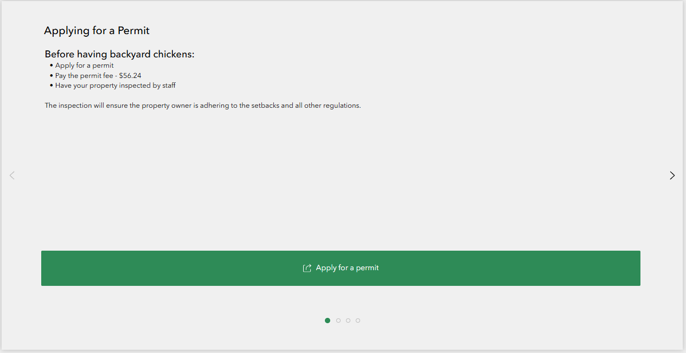

2. Regulation and Best Practice

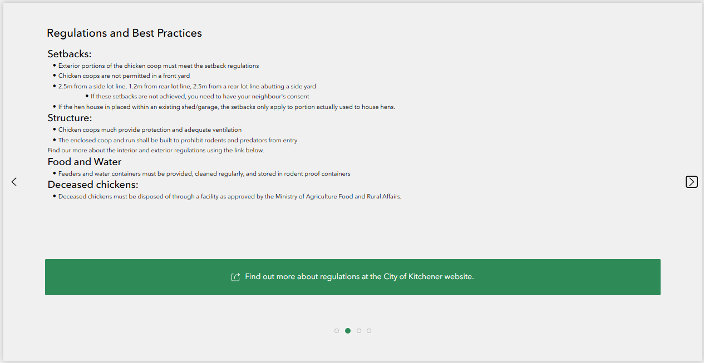

3. Neighbor Consent

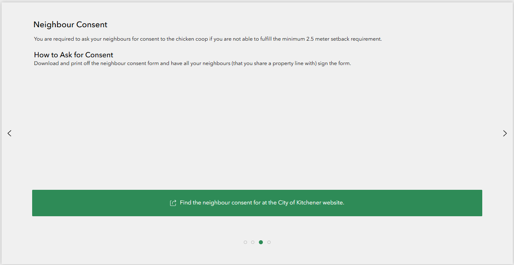

4. Bird Safety Guide

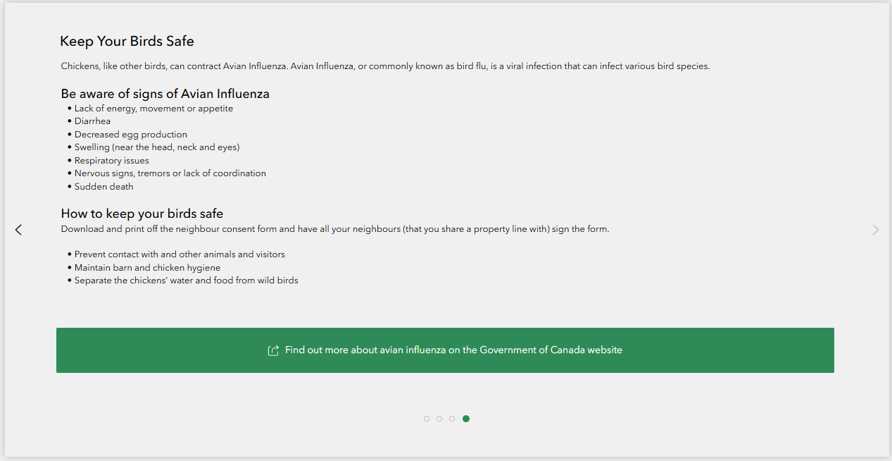

