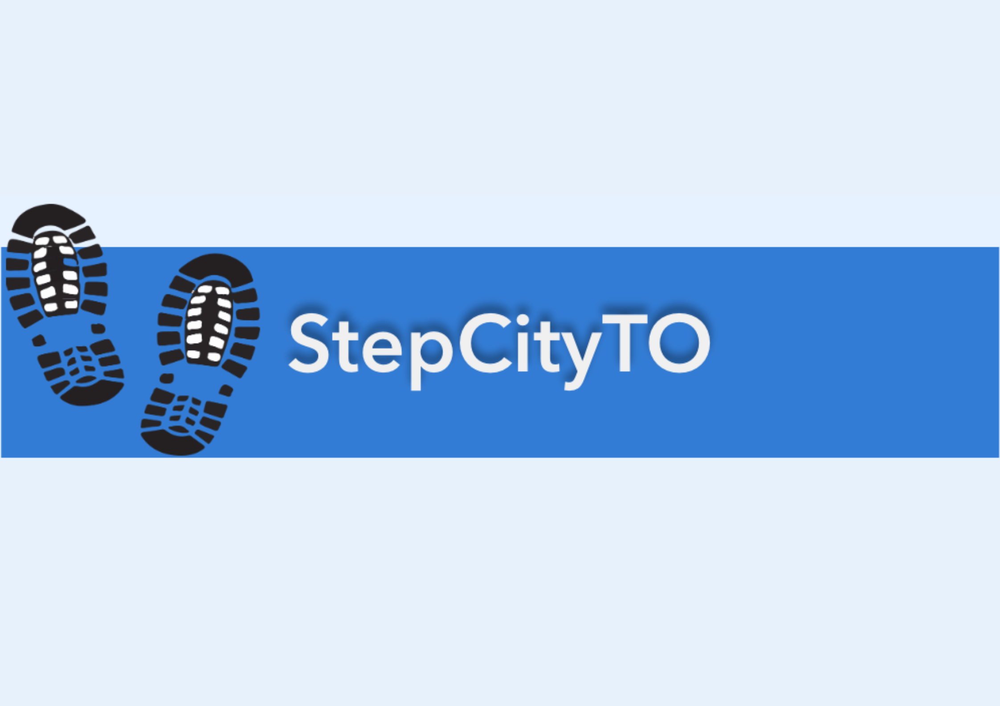

# StepCityTO

### ESRI App Challenge 2025

## MAPthletes

### Team Members
    Kasandra Tworzyannski

    Sophia Wen

    Natali Keckesova
    

    
## Mission Statement:
Our app is dedicated to promoting sustainable urban living in Toronto by providing users with valuable insights into walkability across neighborhoods. By showcasing access to essential services like healthcare, education, and recreational spaces, our app empowers residents to make affordable, eco-friendly choices in their daily mobility. It also acts as a tool for prospective Toronto residents or those currently looking to move into areas with increased walkability. Lastly, the app can be used by policymakers and urban planners aiming to improve urban mobility to identify inaccessible facilities and neighbroohood inequalities across the city. 

The main findings users will get from our app include the count of specific services within a chosen Toronto neighborhood, along with information on the percentage of the neighborhood that has 1 km walking access to each particular service.
The selected variables include pharmacies, libraries, hospitals, health clinics, public schools, EarlyON centres, child care services, supermarkets, convenience stores, and community centres. To provide affordability insights in our app, we filtered child care services to display only subsidized options and included only public schools, as they are government-funded. Additionally, we incorporated EarlyON Child and Family centres, which provide free programs for residents in English and French, with some sites housing Indigenous services as well. 

The data on service types and counts in our app comes from OpenStreetMap (OSM) and the City of Toronto's open data platform. OSM provides up-to-date information on various services, and the City of Toronto offers official datasets on service locations. By combining both sources, our app ensures reliable coverage of services in each neighborhood, helping users make informed decisions about walkability and access to essential resources.

## Statement of Characteristics:
Our app is an intuitive tool designed to help users understand neighborhood walkability in Toronto. By combining interactive filtering, visual analytics, and service coverage insights, the app allows users to explore accessibility in a meaningful way. It is useful for residents seeking walkable communities, policymakers aiming to improve urban mobility, and city planners working toward sustainable urban development. With updated data from OpenStreetMap and the City of Toronto, the app ensures accuracy and reliability, making it a valuable resource for informed decision-making on neighbourhood walkability.

## How to use:
The app is designed to visualize neighbourhood walkability to various services in three ways. 

On the app page **Filter by Walkability Percentage** you can:
- Type a minimum walkability percentage for a particular service on the left sidebar.
- Toggle on the filter and only neighborhoods meeting or exceeding the inputted percentage will be displayed.
- Multiple filters can be applied at once for different services, each with its own percentage threshold.
- If more than one filter is active, the page will only display neighborhoods that meet all selected criteria that are toggled on.
Pop-ups are enabled for all point features. Additional information such as address, contact information, and facility characteristics can be accessed through them. 

On the app page **Walkability Overview** you can:
- Select a Toronto Neighbourhood from the list provided, or select the neighbourhood on the map.
- Following your selection you will see a bar chart summarizing the counts of each service in the selected neighbourhood.
- Additionally, you will receive a summary of the percentage of 1 km walkability coverage for each service in your selected neighbourhood. This service area includes facilities that are located outside of the neighborhood but are within walking distance. 

On the app page **Service Specific Walkability Maps** you can:
- Explore walkability for each service type individually.
- You can select a specific service from a list to view a map with service locations.
- The map includes 0.5 km, 1 km, and 1.5 km isochrone coverage, helping visualize walkability zones.
- Pop-ups are enabled for all point features. Additional information such as address, contact information, and facility characteristics can be accessed through them.

## Data Sources:
### Services and Facilities 
- [EarlyON Child and Family Centres](https://open.toronto.ca/dataset/earlyon-child-and-family-centres/)
    - Containing point and attribute features for all centre locations across Toronto.    
- [Childcare Centres](https://open.toronto.ca/dataset/licensed-child-care-centres/)
    - Containing point features with attribute information for all centre locations in Toronto. only the subsidized centres were selected for this analysis.
- [Parks and Rec](https://open.toronto.ca/dataset/parks-and-recreation-facilities/)
    - Containing point features with attribute information for all Parks and Recreation Facilities in Toronto. Only Community Centers were selected for this analysis. 
- [School Locations](https://open.toronto.ca/dataset/parks-and-recreation-facilities/)
    - Containing point features with attribute information for all Elementary, Middle, and High Schools in Toronto. Only TDSB Public Schools were selected for this analysis.
- [Supermarkets and Convenience stores](https://www.openstreetmap.org/#map=5/48.53/-83.63) Extracted using [Hot Export Tool](https://export.hotosm.org/v3/exports/new/describe)
    - Containing point features with attribute information for all supermarkets and convenience stores in Toronto.
- [Hospitals](https://www.openstreetmap.org/#map=5/48.53/-83.63) Extracted using [Hot Export Tool](https://export.hotosm.org/v3/exports/new/describe)
    - Containing point features with attribute information for all hospitals in Toronto.
- [Pharmacies](https://www.openstreetmap.org/#map=5/48.53/-83.63) Extracted using [Hot Export Tool](https://export.hotosm.org/v3/exports/new/describe)
    - Containing point features with attribute information for all pharmacies in Toronto.
- [Clinics](https://www.openstreetmap.org/#map=5/48.53/-83.63) Extracted using [Hot Export Tool](https://export.hotosm.org/v3/exports/new/describe)
    - Containing point features with attribute information for all clinics in Toronto.
- [Libraries](https://www.openstreetmap.org/#map=5/48.53/-83.63) Extracted using [Hot Export Tool](https://export.hotosm.org/v3/exports/new/describe)
    - Containing point features with attribute information for all libraries in Toronto.

  
### Boundary Files 
- [Pedestrian Network](https://open.toronto.ca/dataset/pedestrian-network/)
    - Containing line features for all pedestrian streets, created from Toronto's sidewalk inventory. 
- [Toronto Neighborhoods](https://open.toronto.ca/dataset/neighbourhoods/)
    - Containing polygon features representing Toronto's 158 neighborhoods.

