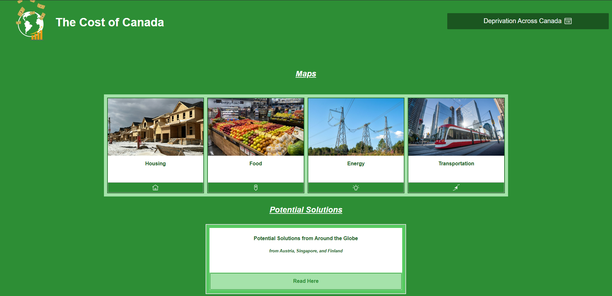
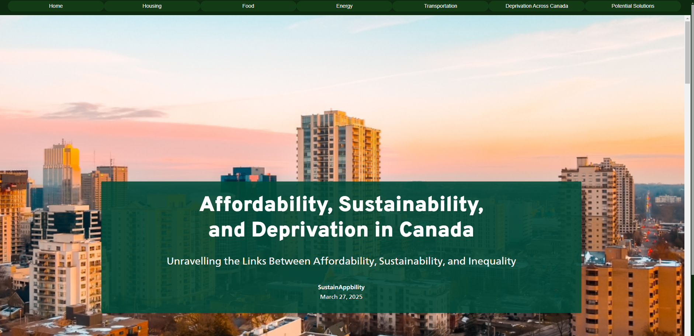
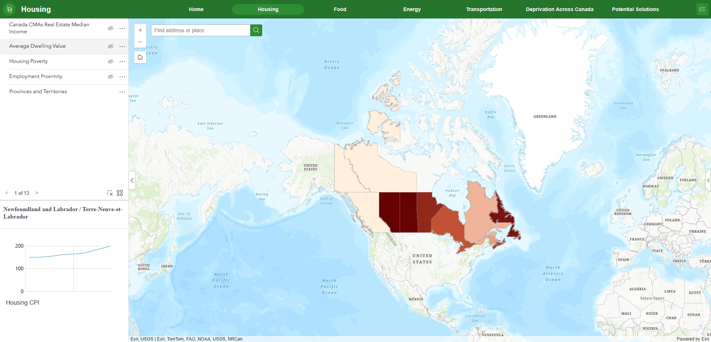
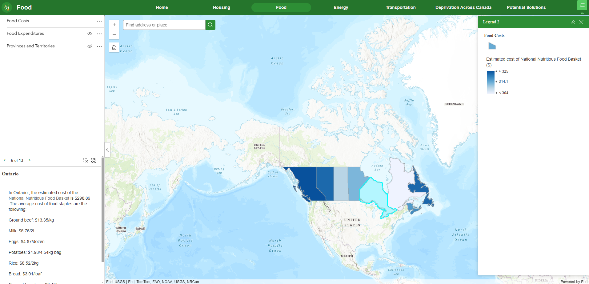
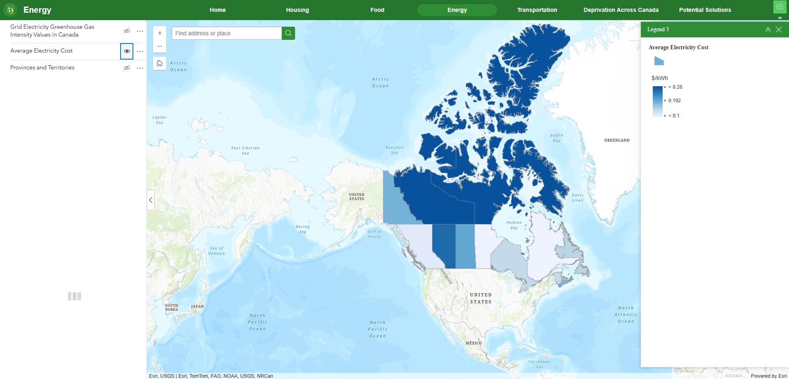
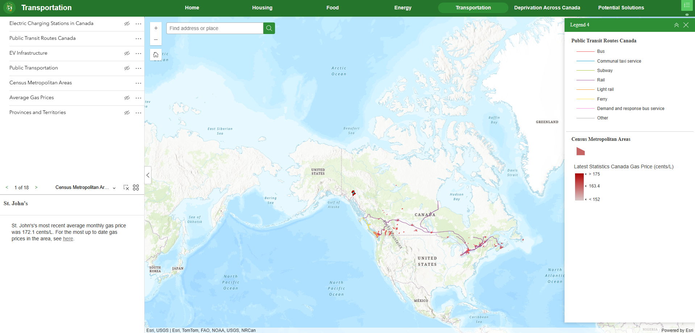
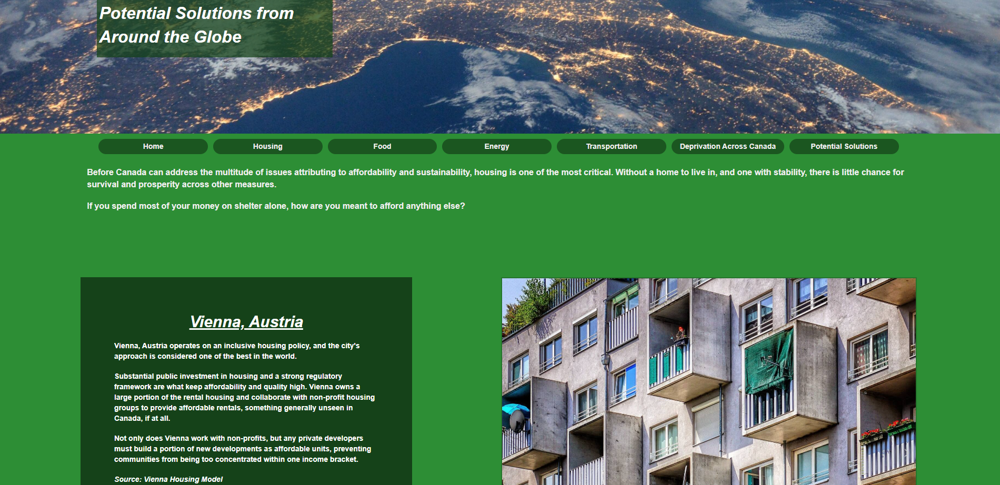

# The Cost of Canada
## Introduction
### Affordability 
Canada is undeniably in a cost-of-living crisis. As of spring 2024, 45% of Canadians reported that rising prices severely impact their ability to make ends meet, a significant increase of 12% from 2022 (Statistics Canada, 2024). Between January 2021 and October 2024, price increases were far more prominent for everyday needs, including shelter & rental costs, food, transportation, and energy (Statistics Canada, 2025). This worsening financial burden on Canadians calls for a sustainable economy that prioritizes affordability, resilience, and long-term stability and well-being for Canadians. 

### Sustainability 
A sustainable economy is one in which the practices support long-term economic growth without negatively impacting the social, cultural, or environmental aspects (University of Mary Washington, n.d). Canada does not align with the key elements of a sustainable economy; not only is the economic dependence on fossil fuels, a high-emission industry, unsustainable, but the affordability crisis prevents financial sustainability for millions of Canadians and worsens economic inequalities.
Mission Statement

The Cost of Canada allows you to see if the grass truly is greener, both in the sense of affordability and sustainability, across the country. Our app brings together the most current information to the consumer on affordability across domains (housing, food, energy, transportation) and places it in a broader spatial context so that the user can gain a better understanding of how their region compares to others. Whether you have your eyes set on green (cheaper) pastures, or simply want to know that you’re not the only area struggling, we provide the information to make those calls. This app also digs into some of the root causes of the affordability crisis in Canada, which are closely linked to the issue of sustainability, where you can see for yourself whether the two seem to go hand in hand, in particular for energy and transportation.

## Mission Statement
The mission of Team Sustainappbility, with the app Cost of Canada is to give Canadians a better standing of the data behind the cost of living crisis we are experiencing; just how much costs have risen to today and in a broader geographic context. This is not something you are going through alone, and we have the maps to prove it. We aim to arm users with the information to weather this challenging time, whether through current pricing information or the ability to areas where the situation may not be so dire in terms of affordability. As per our team we are also concerned with informing users about the sustainability intersecting the cost-of-living crisis particularly in the areas of energy and transportation, where shifts to more sustainable technologies have been slow, and localized.

## About the App

The Cost of Canada allows you to see if the grass truly is greener, both in the sense of affordability and sustainability, across the country. Our app brings together the most current information to the consumer on affordability across domains (housing, food, energy, transportation), places it in a broader spatial context and allows the user to gain a better understanding of their region, as finely as the data allows, compared to others in Canada. Whether you have your eyes set on green (cheaper) pastures, or simply want to know that you’re not the only area struggling, we provide the information to make those calls. This app also digs into some of the root causes of the affordability crisis in Canada, which are closely linked to the issue of sustainability, where you can see for yourself whether the two seem to go hand in hand, in particular for energy and transportation. While this topic and the data seem grim, we offer some potential solutions by drawing inspiration outside the Canadian context.

## App Overview
### Home Page

On our landing page we offer the user a number of options. You can learn more about the issues of affordability, sustainability and deprivation in Canada, or leap right to our map-based modules on four of the core issues facing Canadians today: Housing, Food, Energy and Transportation. 

### StoryMap: Deprivation in Canada

In this StoryMap available in the top corner, you are introduced to some of the causes behind the cost of living crisis in Canada and the metric known as Canadian Index of Multiple Deprivation which can be used to identify the most vulnerable populations. Intersecting with the issue of affordability is sustainability, with the aim of ensuring our activities can continue into the future without irreparable harm to the environment. 

### Housing

Housing in Canada has reached the point of crisis. Housing prices and rental costs are a large portion of many Canadian household budgets, and shelter costs continue to rise. Between January 2021 and October 2024, shelter costs increased nationally by 24.5% (Statistics Canada, 2025). In 2022, 22% of Canadians lived in unaffordable housing, meaning they spent 30% or more of their income on shelter costs; renters are twice as likely to be in this position than homeowners (Statistics Canada, 2024). With so many Canadians struggling to pay for shelter, it is essential to understand where each region falls, especially if you are looking to relocate. 

In the housing module, you are first presented with the housing component of the CPI across provinces, where a click will reveal the trend of the past 10 years. Next, since shelter needs to be close to places of work, we present a measure of employment proximity, and the accessibility of essential services (education, grocery stores, healthcare, etc). Also at this much finer scale of census subdivision you may view the levels of housing unaffordability, or poverty defined by the percentage of households spending 30% or more of income on housing, along with seeing the proportions of renters and homeowners. For a subset of these, from the same Census 2021 data we get closer to an actual dollar value with what homeowners valued their dwelling at. At the CMA level, for current rental prices, we can then see how they compare relative to the median incomes to see if they are roughly in line or disproportionately low or high. If you’re looking to move to one of these areas, or just curious of the most current home prices we’ve provided a handy real estate link for each of them.

### Food Costs

Food is, of course, an everyday need. However, for many Canadians, it is a need that is both extremely costly and not always within reach. Between January 2021 and October 2024, food prices increased by 22.9%, imposing significant financial strain on many Canadian households (Statistics Canada, 2025). When considering that wages only increased by 16.3% in that time, it is unsurprising and alarming that the rate of food insecurity amongst Canadians increased from 18.4% in 2021 to 22.9% in 2022 (Statistics Canada, 2024). As food costs continue to rise and wages lag behind, there is great concern for the future of food security and expenditures across the nation, and understanding the costs of where you are or where you would like to be is essential to your everyday living.  

As with the previous module, you get the inflation numbers for food up front, at the provincial scale in the form of food, one of the eight major components of CPI. You can then view what these have resulted in practice, in the form of annual food expenditures across the provinces and how they break down among food purchases from stores and restaurants. To get more at the prices that mean something immediately to you, the consumer, we’ve estimated the cost of the National Nutritious Food Basket (60+ common healthy food and beverage items in line with Canada’s Food Guide) to give an idea how much it costs to eat healthily, and provided the provincial average prices of various staples.

### Energy

Energy is needed for just about everything we do on a daily basis. You need forms of energy to warm and light your house, power your car by either electricity or gas, cook your food, and more. While Canada continues to increase energy production, Canadians continue to pay more; energy prices have soared since 2002, rising a total of 104.2% (Statistics Canada, 2025). When considering gasoline separately, this product has risen in price by 127.9%, squeezing the wallets of many Canadians who simply need to run errands or get to work (Statistics Canada, 2025). As energy prices increase, many may be concerned on how they will pay to keep their heater on or their car running, and understanding the variance in average energy and gas prices is critical for life choices. 

The energy component of the CPI across the provinces is first presented. While many of us are familiar with how complicated electricity bills can be with various rates and charges, we’ve next provided estimates of average electricity prices per kWh based on a monthly consumption of 1000kWh from energyhub.org, which upon a click will also reveal the composition of their generation mix. That is, how much energy is produced by each source, which have been further refined into renewables such as solar and wind versus non-renewables such as coal and gas. Grid electricity greenhouse gas intensity values provides estimates of the effect of these energy mixes on the atmosphere, as the per kWh CO2 equivalent emissions. Even with similar mixes, power plants and the means of energy production can have great effect, such as in more remote areas that are reliant on generators and thus do not benefit from the efficiencies of scale.

### Transportation

To get from place to place, every person needs some form of transportation. In May 2023, 4 in 5 Canadians travelled to their place of work outside their home, an increase of ~457,000 people from 2016 (Statistics Canada, 2024). Of these commuters, 82.6% travelled by car, truck, or van as either driver or passenger, while 10.1% used public transit (Statistics Canada, 2023). With the number of commuters growing, and the vast majority (92.7%) using a form of transit that costs money, it is concerning that transportation as a whole has increased in price by 71.7% since 2002 (Statistics Canada, 2025). A growing number of Canadians travelling to work, especially by means of vehicle or public transit, the rising costs of transportation are certain to strain many families, and reducing costs based on availability of public transit or lower average prices may be the move for many households. 

The transportation component of the CPI is first presented across the country, which incorporates vehicle upkeep costs, insurance and of course the cost of fuel. We have provided provincial/territorial mean estimates of current gas prices and then gone further to the CMA where Statistics Canada reports monthly averages and you can check out the to-the-minute local prices from user submissions on the website Gasbuddy. In the spirit of sustainability, and transportation that is not as dependent on the ever-changing prices at the pump, have a comprehensive look at Canada’s public transportation networks ranging from the city bus to the VIA Rail that spans nearly the width of the country! We have quantified the relative availability of these systems based on the length of network and number of stops available in each census division. If you are going to go the driving route but a more sustainable option such as an electric vehicle, it will be invaluable to know where the availability of charging stations in your area of interest, either again as a density or the locations of the stations themselves based on a Natural Resources Canada maintained database.

### Potential Solutions

The solutions portion of the app is meant to showcase solutions for affordable housing across the globe. The reason this is centered on housing is because it is largely regarded as the first thing people need before other issues can be addressed; if you spend the majority of your income on your shelter alone, it is extremely difficult to afford other necessities, much less wants. These solutions are drawn from Austria (Vienna), Singapore, and Finland, where each region has taken a different approach to affordable housing, all of which have been greatly successful. 

## _Meet Team Sustainappbility_

I am a fifth year Ph.D of Earth and Environmental Sciences in the Mac Ecohydrology Lab and an ECCE student associate. My research explores the hydrological dynamics of the peatlands of the Boreal Shield and how that influences their resilience to climate change and wildfire. I’ve been a long-time teaching assistant for GIS at McMaster since my M.Sc and integrate it into my field-based research wherever I can. When I’m not in the outdoors for science reasons I also love hiking and fishing, though not typically in peatlands.

Hi all! I’m Jenna, currently in my fifth year of Honours Earth and Environmental Sciences Co-op, and I am an ECCE student associate. I finished the courses for my Geographic Information Systems concurrent certificate in my fourth year, and have had wonderful opportunities to apply my skills and knowledge. In my fourth year, I completed my undergraduate honours thesis assessing the changes in accessibility for seniors to healthcare in Hamilton, Ontario, if the proposed LRT and changes to Hamilton’s bus system take place. My most recent co-op position was with Definity Financial Corporation as a Junior GIS Analyst. I built a custom dashboard for monitoring wildfire proximity to insured policies across Canada. Outside of academia and work, I am a reader with a love for fantasy and non-fiction books, mostly on urban studies, environmental catastrophes, and neurodivergence. I also play The Sims 4 often and take endless pictures and videos of my 1-year-old cat, Benji. 

I am a fifth year Honours Integrated Science student (Earth and Enviro Sci concentration) and an ECCE student associate. I’m pursuing a concurrent certificate in GIS, as well as my GIT designation with Professional Geoscientists Ontario. I completed my undergraduate thesis last year on evaluating badland susceptibility in the Basilicata region of southern Italy, using regression-based multi-criteria decision analysis. I’m interested in the use of GIS for geological and geophysical research, and as a tool for science communication. I am currently a research assistant in McMaster’s Glacial Sedimentology lab, processing drone imagery of multiple glacial lakes in Peru. Outside of academia, I am the vocal director of the MacSci Musical, I play ukulele, and I enjoy taking on small repair projects around my house.

## References
Ali, H., & Zhu, Y. (n.d.). What’s behind Canada’s housing crisis? Experts break down the different factors at play. The Conversation. https://theconversation.com/whats-behind-canadas-housing-crisis-experts-break-down-the-different-factors-at-play-239050

Canada, E. a. C. C. (2025, March 21). Greenhouse gas emissions. Canada.ca. https://www.canada.ca/en/environment-climate-change/services/environmental-indicators/greenhouse-gas-emissions.html

CMHC. Rental Market Survey. (2024, December 17). https://www.cmhc-schl.gc.ca/professionals/housing-markets-data-and-research/housing-data/data-tables/rental-market/rental-market-report-data-tables 

Economic Sustainability - Office of Sustainability. (2023, September 18). Office of Sustainability. https://sustainability.umw.edu/areas-of-sustainability/economic-sustainability/#:~:text=Economic%20sustainability%20refers%20to%20practices,sector%20through%20the%20UMW%20foundation 

Ellmen, E. (2024, December 9). Finance leader warns that Canada is losing the race for a sustainable economy. Corporate Knights. https://www.corporateknights.com/category-finance/canada-losing-the-sustainable-economy-race-andy-chisholm/

Government of Canada. Canada Energy Regulator (2023, November 13) Market Snapshot: Oil Sands Bitumen Production will continue to grow to 2040. https://www.cer-rec.gc.ca/en/data-analysis/energy-markets/market-snapshots/2018/market-snapshot-oil-sands-bitumen-production-will-continue-grow-2040.html

Government of Canada, Canada Energy Regulator (2023, November 24). Canada’s Energy Future 2023: Energy Supply and Demand Projections to 2050. https://www.cer-rec.gc.ca/en/data-analysis/canada-energy-future/2023/index.html

Government of Canada, Environment and Climate Change Canada (2022, June 8 updated 2024, May 6). National Inventory Report 1990 – 2022: Greenhouse Gas Sources and Sinks in Canada.

Government of Canada, Environment and Climate Change Canada.(2025) Canadian Environmental Sustainability Indicators: Greenhouse gas emissions. Consulted on March 26 2025. www.canada.ca/en/environment-climate-change/services/environmental-indicators/greenhouse-gasemissions.html 

Government of Canada, Natural Resources Canada (2022, September 27). Canadian Public Transit Systems. https://open.canada.ca/data/en/dataset/b8241e15-2872-4a63-9d36-3083d03e8474  

Government of Canada, Statistics Canada. (2022a, July 13). Household income statistics by household type: Canada, provinces and territories, census divisions and census subdivisions. https://www150.statcan.gc.ca/t1/tbl1/en/tv.action?pid=9810005701 

Government of Canada, Statistics Canada. (2022b, September 27). 2021 Census Boundary files. https://www12.statcan.gc.ca/census-recensement/2021/geo/sip-pis/boundary-limites/index2021-eng.cfm?year=21 

Government of Canada, Statistics Canada (2023, August 23). Proximity Measures Database, 2021. https://www150.statcan.gc.ca/n1/pub/17-26-0002/172600022023001-eng.htm 

Government of Canada, Statistics Canada. (2023, November 10). Canadian Index of Multiple Deprivation: User Guide, 2021. https://www150.statcan.gc.ca/n1/pub/45-20-0001/452000012023002-eng.htm 

Government of Canada, Statistics Canada. (2024, August 15) Nearly half of Canadians report that rising prices are greatly impacting their ability to meet day-to-day expenses. https://www150.statcan.gc.ca/n1/daily-quotidien/240815/dq240815b-eng.htm

Government of Canada, Statistics Canada. (2025a, January 21). Add/Remove data - Consumer Price Index, annual average, not seasonally adjusted. https://www150.statcan.gc.ca/t1/tbl1/en/cv.action?pid=1810000501

Government of Canada, Statistics Canada. (2025b, January 22). Research to Insights: Perspectives on Affordability and Inequality. https://www150.statcan.gc.ca/n1/pub/11-631-x/11-631-x2025001-eng.htm 

Growth of the city - History of Vienna. (2007, November 22). https://www.wien.gv.at/english/history/overview/growth.html

HDB | Committee of Supply 2025. (n.d.). https://www.hdb.gov.sg/cs/infoweb/hdbnews/Committee-of-Supply-2025

Housing & Development Board (HDB). (n.d.). https://www.hdb.gov.sg/cs/infoweb/homepage

Muzzerall, P. (n.d.). Oilsands workers are resistant to sustainable jobs, new research finds. The Conversation. https://theconversation.com/oilsands-workers-are-resistant-to-sustainable-jobs-new-research-finds-239057#:~:text=While%20the%20Sustainable%20Jobs%20Act,the%20jobs%20they%20already%20have

Shelley. (2022, September 2). Fifty years in the making of Ontario’s housing crisis – a timeline - Canadian Centre for Housing Rights. Canadian Centre for Housing Rights. https://housingrightscanada.com/fifty-years-in-the-making-of-ontarios-housing-crisis-a-timeline/ 

Targeting the right housing supply in Canada - School of Cities. (2024, October 24). School of Cities. https://schoolofcities.utoronto.ca/housing-supply-mix-strategy/ 

Urban, Rylan. (2023, September 3) Electricity Prices in Canada 2023. https://www.energyhub.org/electricity-prices/ 

Y-Säätiö. (2024a, December 2). Housing first in Finland - Y-Säätiö. https://ysaatio.fi/en/housing-first/ 

Y-Säätiö. (2024b, December 17). Homelessness - Y-Säätiö. https://ysaatio.fi/en/housing-first/homelessness-in-finland/

## Additional Data Sources (Statistics Canada Tables)
Statistics Canada. Table 11-10-0125-01  Detailed food spending, Canada, regions and provinces DOI: https://doi.org/10.25318/1110012501-eng Date modified: 2025-03-26

Statistics Canada. Table 13-10-0834-01  Food insecurity by economic family type DOI: https://doi.org/10.25318/1310083401-eng Release date: 2024-04-26 Date modified: 2025-03-26

Statistics Canada. Table 18-10-0001-01  Monthly average retail prices for gasoline and fuel oil, by geography DOI: https://doi.org/10.25318/1810000101-eng Date modified: 2025-03-28

Statistics Canada. Table 18-10-0002-01  Monthly average retail prices for food and other selected products DOI: https://doi.org/10.25318/1810000201-eng Date modified: 2025-03-25

Statistics Canada. Table 18-10-0005-01  Consumer Price Index, annual average, not seasonally adjusted DOI: https://doi.org/10.25318/1810000501-eng  Date modified: 2025-03-25

Statistics Canada. Table 18-10-0205-01  New housing price index, monthly DOI: https://doi.org/10.25318/1810020501-eng  Date modified: 2025-03-26

Statistics Canada. Table 18-10-0245-01  Monthly average retail prices for selected products DOI: https://doi.org/10.25318/1810024501-eng Date modified: 2025-03-25

Statistics Canada. Table 98-10-0057-01  Household income statistics by household type: Canada, provinces and territories, census divisions and census subdivisions DOI: https://doi.org/10.25318/9810005701-eng

Statistics Canada. Table 98-10-0257-01  Value (owner-estimated) of dwelling by structural type of dwelling : Canada, provinces and territories and census subdivisions with a population 5,000 or more DOI: https://doi.org/10.25318/9810025701-eng Date modified: 2025-03-28
