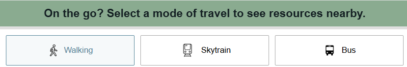
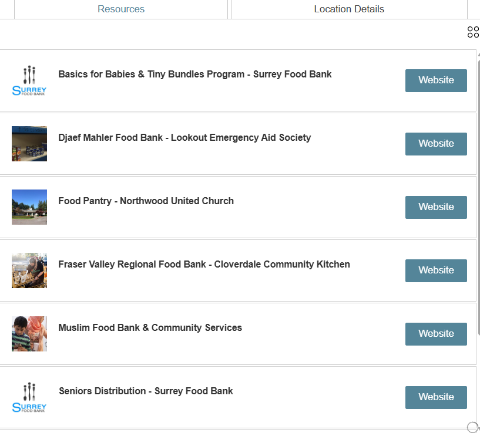
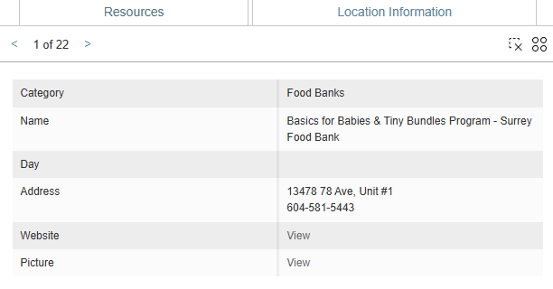
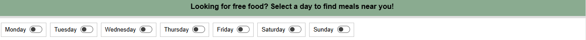
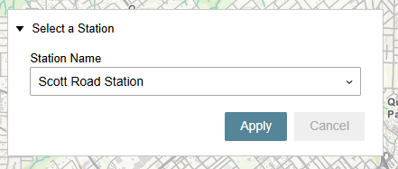
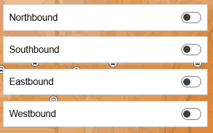
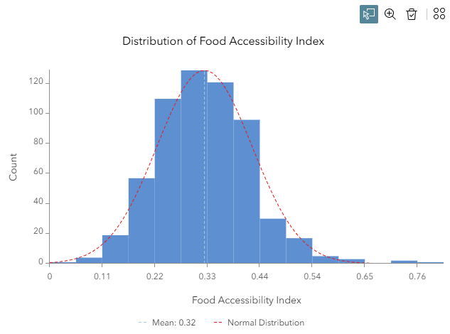
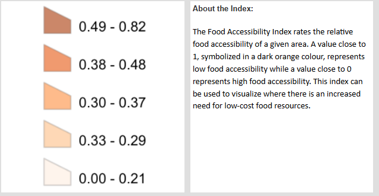
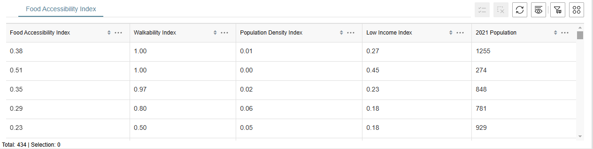

# Sustainable Foodies

> This is a web application for finding low cost community food resources and for visualizing the food accessibility index within the City of Surrey.

## Link to App: 
[App Link ](https://arcg.is/1T0SXq0 )

## Team

- Sammi Lo
- Kimberley Neumann
- Michael Chan

## Mission Statement

In 2015, the United Nations established 17 Sustainable Development Goals to promote “peace and prosperity for people and the planet”⁽¹⁾.  These goals cover multiple domains, from poverty to climate actions and encapsulate a movement in society towards an adaptable and sustainable future benefits.

As part of this effort, the Canadian government has committed to the 2030 Agenda for Sustainable Development and has published two reports detailing their progress in implementing these goals. The progress is measured using the Canadian Indicator Framework for Sustainable Development and each goal is subdivided into smaller subcategories which are given a rank in comparison to the 2030 target. Many of the goals are intertwined, relying on complex factors that are difficult to unravel. Underpinning a strong Canadian economy is ensuring that the people that live here can meet their basic needs. After all, if people can’t meet their basic needs, how are they going to innovate and advocate for greater societal change?

The second sustainable development goal highlights the need to end hunger across Canada. Stating that “all people in Canada are able to access a sufficient amount of safe, nutritious, and culturally diverse food”⁽²⁾. With the rising cost of living, uncertainty of foreign relations, and lasting effects of Covid-19, Canada’s last report on the state of the zero-hunger goal saw a deterioration in the country’s food security. This means that less Canadians have access to food now than in 2015. These effects are not only seen at a federal level, but in researching the local effects of hunger, the results remained similar. In 2024, the City of Surrey, British Columbia released a report detailing their findings from community engagement forums. This report sought to understand how the public felt about a variety of issues and was released in preparation of the City of Surrey’s new Social Development Plan. The report highlights that Surrey citizens are concerned with the affordability of food, the high demand for food banks, and lack of access to nutritious, culturally diverse food options. Citizens also reported that the city should increase access to non-for-profit grocery stores, increase neighbourhood or grassroots food security programs, and work towards destigmatizing accessing food supports.

In support of creating an affordable and sustainable future, our team has worked to create an app for the residents of Surrey that will help to address their concerns and identify areas of need across the city. This will help in both the short term, providing residents with critical information to help reduce hunger, and the long term, allowing decision makers to see and download information to help aid in critical decision making. As the Surrey Social Development Plan is still being reworked, this app may have a real impact in lobbying city officials to increase support in areas of need. 

## Statement of Characteristics 
Nourish Surrey seeks to perform two main functions. The first is to arm citizens of Surrey with a resource that allows them to find free or low-cost food available in their area. Since there is a reported stigma against utilizing food resources, it can be assumed that many individuals may not know the exact locations of these resources. To educate the public, the app highlights the locations of food banks, free or low-cost grocery stores, and centers that provide free or low-cost meals. Additionally, the user can toggle different days of the week to see what free meal services are in operation. Each of the free meal locations were verified to be operational as of March 2025 which is important as many of the locations listed on 211 and the City of Surrey’s Community Food Resources map were incorrect. We believe that by providing accurate, up-to-date information, users will be more likely to utilize the service. They do not need to perform any additional steps than looking at the app to identify where they can get their needs met. Reducing the barriers to entry allows more to access the resource. 

Users can select a method of travel, which allows them to view various distance buffers. These buffers indicate a walking time radius around a point of interest. For example, if a user was interested in visiting the Surrey Urban Mission, they can see if they are within a 10 or 30-minute walk. If they aren’t currently within those walking distances, the same user could then check to see what skytrain stations or bus stops are within a 10-minute walk of the mission. Allowing users to visualise distances addresses accessibility concerns, as those with limited mobility may need to verify how far they will need to travel after transiting. These radii also give citizens more agency. In visualising the locations of services, users can see where services are absent. They can then lobby local government organizations strategically. 

To further aid in addressing unmet need, a Food Accessibility Index was created. Here, users can see areas of need across Surrey created from a boundary's proximity to a free or low-cost resource, normalized population, and poverty index. To provide further insights, an optional layer showing well-served areas can be toggled on. The table and chart will update to show the distribution and records for a set map extent. Although primarily a visualisation tool, users can select multiple records in the table and export them to a CSV, JSON, or GeoJson file for further use. 

## Explanation of Food Accessibility Index 

Our team developed a single value index in order to evaluate the relative degree of accessibility to low-cost food resources for a particular dissemination area (DA) located in the City of Surrey. The index ranges from 0 to 1 where 0 represents a low level of need for more low-cost food resources in the DA. Here, there is no unmet need for low-cost community food resources as there is a high accessibility to current resources. On the other hand, a value of 1 represents a high level of need for more low-cost food resources as there is currently an unmet need in the area. The index considers various factors such as the overall walkability to the nearest low-cost food resource, the income level of families, and the population density of the DA. 

## Methodology and Limitations
### Calculating Walking Travel Time Areas and Gaps

Two walking travel time areas were created via network analysis within ArcGIS Online using the Generate Travel Areas Tool with the Walking Time option selected. This tool generated a 10 minute walking time coverage polygon and a 30 minute walking time coverage polygon from all of the low-cost food resources. 

### Calculating the Walkability Index

The walkability of a DA was evaluated based on the proportion of the DA covered by the 0-10 minute and 10-30 minute walking travel time areas. An index score was then computed based on the proportion of a DA’s area covered by the 0-10 and 10-30 min walking time coverage polygon. Values were then normalized using a linear relationship based on the proportion of coverage. An index of 0 would mean walkability is very high as the DA is 100% covered by the 10 minute walking time coverage polygon. A value of 1 would mean the DA has 0% coverage by either the 0-10 or 0-30 walking time travel area layers and thus the walkability is very low.

### Cacluating the Normalized Low Income Index

The low income index was based off of the low income index provided by Statistics Canada for each DA in Surrey. The index represents the proportion of families with an income that is below the low income threshold. This means the family must spend 20% or more of their post-tax income on food, shelter and clothing. In order to compare income levels between areas in Surrey, the low income index was normalized to values ranging from 0 to 1 based on the minimum and maximum values of the low income index within Surrey. A value of 0 means that a particular DA has a relatively low proportion of low income families whereas a value of 1 means a high proportion of families considered low income. 

### Calculating the Normalized Population Density Index

The population density index was calculated based on the population density for each DA provided by Statistics Canada. Values were then normalized in order to better compare the relative population densities between the DAs in Surrey. This was done using the minimum and maximum population density values and scaled linearly to values ranging between 0 and 1.

### Calculating the Overall Food Accessibility Index

The overall food accessibility index was calculated using Multi-Criteria Decision Analysis (MCDA). The three factors of walkability, low income, and population density were assigned weights relative to their importance. In order to assist with quantifying the relative importance of these three variables relative to each other, an AHP analysis was conducted. 

| Index                               | Priority | Rank |
| ----------------------------------- | -------- | ---- |
| Normalized Low Income Index         | 71.5%    | 1    |
| Walkability Index                   | 18.7%    | 2    |
| Normalized Population Density Index | 9.8%     | 3    |

Finally, using a weighted linear combination equation and the computed weights, an overall food accessibility index was calculated quantifying the relative accessibility to low cost food resources within a DA. 

$$
\text{Accessbility Food Index}(i) = (w_1 \cdot x_{i1}) + (w_2 \cdot x_{i2}) + (w_3 \cdot x_{i3})
$$

<em>Where:</em>

- <em>w1 (walking) = 0.187
- w2 (low income) = 0.715
- w3 (population density) = 0.098</em>

## Limitations

### Accessibility Index

One of the major limitations of this analysis was seen when determining the number of factors that could have been included within the Food Accessibility Index. Due to data and time limitations, other factors which may also contribute to how accessible low-cost food resources are for a particular DA were not included. Moreover, the weighting applied to the index gave the highest importance to areas of lower income over the walkability and population density.  The relative ranking of these factors may vary based on the priority of the study and therefore may be somewhat subjective to the priorities of the individual. 

### Dissemination Area Census Data

Dissemination areas were chosen to represent results as these boundaries were the smallest division provided by Statistics Canada that contained income and population density data. As a result, the granularity was limited by how the dissemination areas were drawn up. The generalization of results to each dissemination area may also obscure internal variations within a DA, resulting in an index that may not be reflective of smaller areas within a DA. Sections of a DA may have a high index while a portion of the DA may have a low index resulting in a moderate value and as a result results may not capture the nuances within the DA. 

### Municipal Boundary

Low-cost food resources outside of the city boundary were not included in the study. However, the exclusion of these resources may result in changes in the accessibility index, especially near DAs located near city boundaries. 

## User Guide

> The application is divided into two separate sections; the Food Finder, which users can utilize to search and explore low cost food resources in Surrey, and the Food Accessibility Dashboard which provides users with information on the relative accessibility of low-cost food resources across Surrey while highlighting areas that may require an increase in food resources.  

### Food Finder

#### Choose Mode of Travel

Located on the top right section, users can navigate between different views based on their desired mode of travel (walking, skytrain, or bus). Selecting any of the options will navigate to the corresponding view and will update the map as well as the widgets displayed. 

#### Food Resources Legend

The legend provides users with the meaning of the three different categories of low-cost food resources displayed on the map. 

#### Resources

Users can view a list of food resources visible on the current map by clicking the “Resources” Tab. Here, users can export the current list of resources to a CSV, GeoJSON, or JSON file by clicking the action button on the top-right corner of this widget. 

#### Location Information

Relevant Information describing the current low-cost food resources visible on the map are displayed in the “Location Information” tab. This includes the category, name, day that the resource is available, address, and website. 

#### Day of the Week Filter

Located at the bottom section of the web application, users can toggle on or off each of the days of the week. This will filter the food resources on the map to display free or low-cost meals that are provided on the selected day of the week. The toggles will also filter the Resources and Location Information widgets. 

#### Display Walking Time Travel Areas

Located near the top of the map, these buttons allow users to select 0-10 minute or 0-30 minute walking times, which will display the corresponding walking time travel areas around all of the food resources. This display is only available when the Walking option is selected in the Mode of Travel widget. 

#### Skytrain Stations Filter

Located on the top left of the map, users can select one of four Skytrain stations in Surrey. The 10 minute walking time travel areas surrounding a the selected Skytrain station will be filtered and displayed on the map. Users can explore which low cost community food resources are within a 10 min walking time from the Skytrain station.  This display is only available when the Skytrain option is selected in the Mode of Travel widget. 

#### Travel Time Area from Bus Stops

Located on the top left corner of the map when the Bus option is selected in the Mode of Travel widget, users can select the corresponding bus route direction that they want to display. Once checked, the 5 minute travel time areas from bus stops corresponding to the selected direction of travel will be displayed on the map. Users can explore the low cost food resources that are within 5 minutes of a bus stop. 

### Food Accessiblility Dashboard:

#### Food Accesibility Index Histogram

Located on the top right, a histogram shown which is dynamically updated based on the map extent. This histogram shows a breakdown of index values for the given extent. Users can export the histogram values to a CSV, GeoJSON, or JSON files by clicking the action button in the top-right corner. 

#### Legend and Index Information

Users can find the index symbolization and their corresponding index value ranges.
The overall food accessibility index was calculated using Multi-Criteria Decision Analysis (MCDA). The three factors of walkability, low income, and population density were assigned weights relative to their importance. In order to assist with quantifying the relative importance of these three variables relative to each other, an AHP analysis was conducted. Using a weighted linear combination equation and the computed weights, an overall food accessibility index was calculated quantifying the relative accessibility to low cost food resources within a DA. 

#### Index Results Table

Users can view the different index values for the current dissemination areas within the current map view. If desired, specific dissemination areas can be selected by clicking a row. This will highlight the corresponding polygon on the map. Users can export the table values to a CSV, GeoJSON, or JSON file by clicking the action button in the top-right corner.

####

## Data Sources

| Dataset | Type | Description/Purpose | Projection | Source | Format |
| :---- | :---- | :---- | :---- | :---- | :---- |
| Community Food Resources | Point | Location Food resource description  | WKID: 3857 | [City of Surrey](https://services5.arcgis.com/YRpe0VKTJytZSSIB/arcgis/rest/services/Surrey_Community_Food_Resources/FeatureServer/0%20)  | Feature Service |
| Low Cost and Free Resources | Point | Location of additional low cost and free food resources | WKID: 29610 | [City of Surrey](https://data.surrey.ca/dataset/low-cost-and-free-resources)  | Feature Geodatabase |
| Street Network  | Network | Network was used to generate travel areas  |  | ESRI  |  |
| Surrey City Boundaries | Polygon | City of Surrey Boundaries | WKID: 26910  | [City of Surrey](https://data.surrey.ca/dataset/surrey-city-boundary%20) | Feature Geodatabase |
| Skytrain Stations | Points | Point locations of skytrain stations | WKID: 4326 | [Translink](https://www.translink.ca/about-us/doing-business-with-translink/app-developer-resources/gtfs/gtfs-data) | GTFS Static Data (.txt files) |
| Bus Stops | Points | Point locations of bus stops | WKID: 29610 | [City of Surrey](https://data.surrey.ca/dataset/transit) | Feature Geodatabase |
| 2021 Surrey Census Data | Polygon | Provide population and income data  | WKID: 26910 | [City of Surrey](https://data.surrey.ca/dataset/2021-surrey-census%20) | Feature Geodatabase |

### Video Sources
* [Walking Icon](https://pngtree.com/so/walking-icon)
* [Time-Lapse Video-of a Person Pushing the Grocery Cart](https://www.pexels.com/video/time-lapse-video-of-a-person-pushing-the-grocery-cart-4309734/)
* [High Angle Shot of Vegetables] (https://www.pexels.com/video/high-angle-shot-of-vegetables-5866122/)
* [Woman Serving Food For The Group] (https://www.pexels.com/video/woman-serving-food-for-the-group-3760750/)
* [Time Lapse Video Of Vancouver City In A Day's Time](https://www.pexels.com/video/city-clouds-haze-travel-4265473/)
* [High Angle Shot of Vegetables] (https://www.pexels.com/video/high-angle-shot-of-vegetables-5866122/)
* [Soup Plate Full of Coins] (https://www.pexels.com/video/soup-plate-full-of-coins-6764575/)
* [Coins Issued From Different Countries] (https://www.pexels.com/video/hand-rich-money-gold-3943971/ )
* [Aerial View of Surrey Cityscape with Skyscrapers] (https://www.pexels.com/video/aerial-view-of-surrey-cityscape-with-skyscrapers-28939455/ )
* [Free Food] (https://www.pexels.com/video/free-food-6893784/)
* [Person Packing Food] (https://www.pexels.com/video/person-packing-food-6894088/ )

### Photos
* [SDG Week] (https://www.niagaracollege.ca/insidenc/2023/03/10/sdg-week-canada-increases-awareness-of-17-sustainable-development-goals/)
* [United Nations Sustainable Development Goals] (https://www.google.com/url?sa=i&url=https%3A%2F%2Fun-sdgs.mcmaster.ca%2Fgoals%2Fgoal-2-zero-hunger%2F&psig=AOvVaw26Vc7tM3LT7OpyhidZcXN2&ust=1743467142025000&source=images&cd=vfe&opi=89978449&ved=0CBcQjhxqFwoTCPiYnq-Hs4wDFQAAAAAdAAAAABAJ) 
* [Question Marks on Craft Paper] (https://www.pexels.com/photo/question-marks-on-craft-paper-5428830/) 
* [Colorful Plastic Fork and Bowl] (https://www.pexels.com/photo/colorful-plastic-fork-and-bowl-over-a-wooden-table-7123557/) 

### Inspiration
* [Vancouver Food Asset Map] (https://www.google.com/maps/d/viewer?mid=1XEmhBp-1P0xxH7ZPFMc76sBFb2U&ll=49.261108757904346%2C-123.06872792387054&z=13) 
* [Community Food Resources] (https://cosmos.surrey.ca/external/tools/CommunityFarmsAndFood/?_gl=1*1pct1n4*_gcl_au*MzUxMzIxOTA4LjE3NDI4NDQ2MDQ.*_ga*NDExNjI4MDk3LjE3NDI4NDQ2MDQ.*_ga_L5CPYH78W6*MTc0Mjg0NDYwMy4xLjEuMTc0Mjg0NDYyNC4zOS4wLjA.*_ga_SQQXD1G49W*MTc0Mjg0NDYwMy4xLjEuMTc0Mjg0NDYyMy40MC4wLjA)
* [Free and Low Cost Food Programs in Vancouver]
(https://vancouver.ca/files/cov/emergency-meal-program-map.pdf) 

### Literature Sources
[(1) https://unosd.un.org/content/sustainable-development-goals-sdgs](https://unosd.un.org/content/sustainable-development-goals-sdgs)

[(2) https://www.canada.ca/en/employment-social-development/programs/agenda-2030/zero-hunger.html](https://www.canada.ca/en/employment-social-development/programs/agenda-2030/zero-hunger.html)

## Video Description
Nourish Surrey seeks to perform two main functions. The first is to arm citizens of Surrey with a resource that allows them to find free or low-cost food available in their area. Since there is a reported stigma of those utilizing food resources, it can be assumed that many individuals may not know the exact locations of these resources. To educate the public, the app highlights the locations of food banks, free or low-cost grocery stores, and centers that provide free or low-cost meals. Additionally, the user can toggle different days of the week to see what free meal services are in operation. Each of the free meal locations were verified to be operational as of March 2025 which is important as many of the locations listed on 211 and the City of Surrey’s Community Food Resources map were incorrect. We believe that by providing accurate, up-to-date information, users will be more likely to utilize the service. They do not need to perform any additional steps than looking at the app to identify where they can get their needs met. Reducing the barriers to entry allows more to access the resource.

