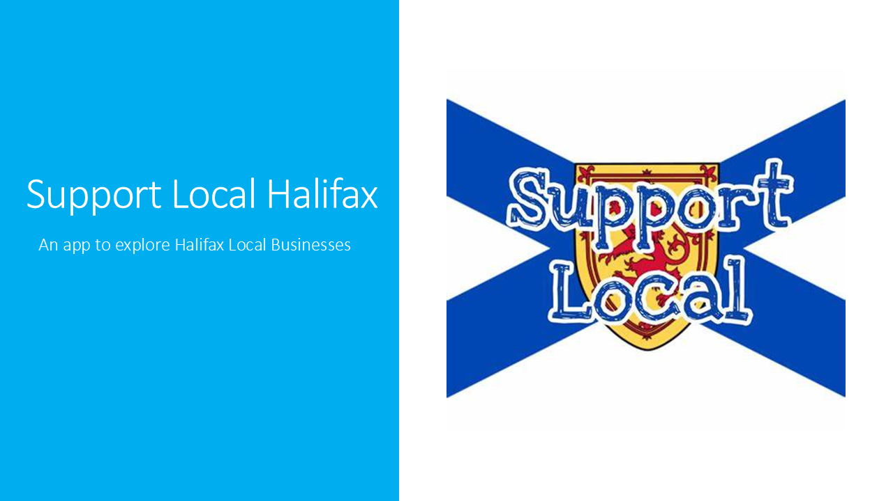
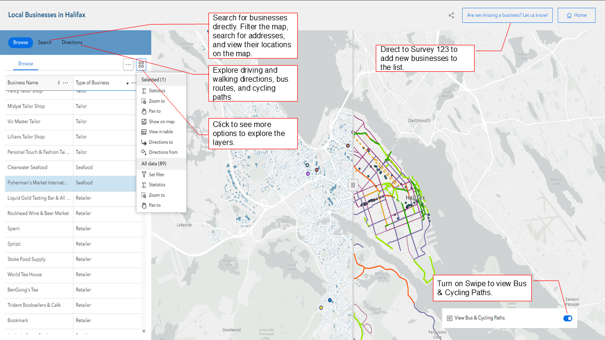

# Three Broke Girls
## Team
- Roxanne Dorris
- Sasha Chilibeck
- Mo Li
# Mission Statement 
Shopping local is something Canadians are increasingly encouraged to do, but it can be overwhelming to research where to go for all your needs when using traditional mapping apps and search engines. Our app, Support Local Halifax, uses open data to highlight local businesses and green transportation route options of Halifax to help users make more sustainable shopping decisions. Canadians have recently been under more pressure to buy local as geopolitical tensions grow between us and our closest trading partner. Furthermore, shopping local can help reduce the carbon footprint associated with manufacturing and shipping goods over long distances. It may also aid in reducing the exploitation of more vulnerable ecosystems and communities that do not have the same environmental or labour protections as Canadians are privileged with. We hope that users will turn to our app to find a store for their needs and then utilize the swiping feature to view bus and bike routes as alternatives to driving. 

# Statement of Characteristics
The app does not include all local businesses present in the core Halifax area, but we have included a survey feature that allows for easy updates to the map to add more businesses. Additionally, our app does not factor in barriers to taking green transportation such as the fitness level of users (cycling) or wait-times (bus routes), so we encourage users to make well-informed transportation decisions using alternative resources. 

Through Support Local Halifax, we hope to answer the following questions to aid citizens of the Halifax Regional Municipality support local, sustainable economies:

Where are local businesses located in high density in Halifax? Are many of these businesses located along accessible green transportation options? What diversity of shopping needs are met by local businesses (see categories below)?

Businesses were broken up into the following categories:
-	Centres for Arts & Culture
-	Bakeries
-	Breweries & Bars
-	Chocolatiers
-	Clothing
-	Delis
-	Farmers Markets
-	Grocers
-	Restaurants
-	Retailers
-	Seafood

We acknowledge that this may overlook certain businesses and are open to receiving feedback for adding new categories, which can be done using our suggestions forms (see app homepage or top right of app).

# Explore the App

Access the App : [Support Local Halifax](https://experience.arcgis.com/experience/2ba906ebe99740f19804880fcc4c3118/)
# Open Source Data
### Data Used 
| Data Name | Data Source | Data Type | Data Link |
|-----------------|-----------------|-----------------|-----------------|
| Halifax Local Businesses      | Province of Nova Scotia      | Point      | [Buy Local NS](https://buylocal.novascotia.ca/business-search?name=&region=All&product=All)     |
| Bus Path      | Halifax Open Data      | Polyline      | [Transit Bus Routes](https://data-hrm.hub.arcgis.com/datasets/69adb7a88a4e4343bf5ae7c381f2d9af_0/explore?location=44.726164%2C-63.570870%2C11.11)     |
| Cycling Paths     | Halifax Open Data      | Polyline      | [Bike Infrastructure](https://data-hrm.hub.arcgis.com/datasets/460bba0983504ff9a3d74f144128b1ad_0/explore?location=44.759662%2C-63.246358%2C9.65)     |
| Halifax Building Uses      | Halifax Open Data      | Polygon      | [Building Details](https://data-hrm.hub.arcgis.com/datasets/255ffc6d20734218a6647d6ba18ccfda_0/explore)    |

